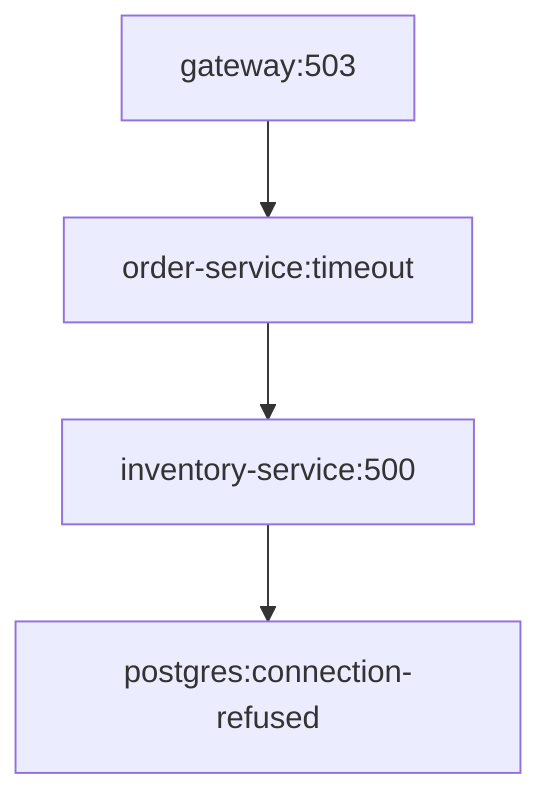

name: trace-mapper
description: Mapea traces de sistemas distribuidos para identificar cuellos de botella, fallos y dependencias de servicios en arquitecturas de microservicios
version: 1.2.0
author: OpenClaw DevOps Team
tags:
  - tracing
  - distributed-systems
  - performance
  - debugging
  - observability
requires:
  - openclaw-cli>=2.5.0
  - jq>=1.6
  - graphviz>=2.50.0
  - python3>=3.9
  - pip
  - jaeger-client|zipkin-client|otlp-collector
dependencies:
  python:
    - pyarrow>=12.0.0
    - pandas>=2.0.0
    - networkx>=3.0
    - matplotlib>=3.7.0
    - plotly>=5.14.0
environment:
  TRACE_SOURCES: "jaeger,zipkin,otlp"
  TRACE_STORAGE: "elasticsearch|clickhouse|tempo"
  JAEGER_ENDPOINT: "http://localhost:16686"
  ZIPKIN_ENDPOINT: "http://localhost:9411"
  OTLP_ENDPOINT: "http://localhost:4317"
  ANALYSIS_WINDOW: "1h"
  SAMPLING_RATE: "1.0"
```

# Habilidad Trace Mapper

## Propósito

Trace Mapper analiza datos de trazado distribuido para identificar cuellos de botella de rendimiento, fallos en cascada y problemas de dependencias de servicios en arquitecturas de microservicios. Procesa datos de trace de recolectores Jaeger, Zipkin u OTLP y genera gráficos de dependencias visuales, mapas de calor de latencia e informes de propagación de errores.

**Casos de uso reales:**
- Investigar picos de latencia p99 en servicios de producción
- Identificar puntos únicos de fallo en service mesh
- Analizar la causa raíz de interrupciones parciales del sistema
- Validar decisiones de arquitectura post-despliegue
- Planificación de capacidad basada en patrones de carga derivados de traces
- Detectar dependencias circulares que causan tormentas de reintentos

## Alcance

Comandos disponibles:
- `analyze-traces` - Procesa datos de trace y identifica anomalías
- `map-dependencies` - Genera grafo de dependencias de servicios
- `find-bottlenecks` - Identifica cuellos de botella de latencia con análisis de flames
- `trace-compare` - Compara patrones de trace entre despliegues
- `error-propagation` - Rastrea cascadas de error a través de servicios
- `export-report` - Genera informe de análisis HTML/PDF
- `live-monitor` - Transmite análisis de trace en tiempo real
- `sampling-stats` - Reporta sobre cobertura de muestreo de traces

## Proceso de Trabajo Detallado

### 1. Validación de Prerrequisitos
```bash
openclaw skill trace-mapper check-env
```
Verifica que los endpoints de trace sean accesibles y que las dependencias de Python estén instaladas.

### 2. Recopilación de Trace
```bash
openclaw trace-mapper analyze-traces \
  --sources jaeger,zipkin \
  --window "24h" \
  --service-checkout,order,payment \
  --output-format parquet
```
- Consulta los backends de trace configurados
- Aplica filtrado por ventana de tiempo
- Normaliza contextos de span entre formatos
- Genera tabla Arrow para análisis

### 3. Mapeo de Dependencias
```bash
openclaw trace-mapper map-dependencies \
  --input traces.parquet \
  --min-calls 10 \
  --exclude "istio-proxy,envoy" \
  --format dot \
  --output dependency_graph.dot
```
- Construye grafo dirigido de llamadas entre servicios
- Filtra proxies de infraestructura
- Calcula pesos de aristas por volumen de llamadas
- Exporta a formato DOT de Graphviz

### 4. Análisis de Cuellos de Botella
```bash
openclaw trace-mapper find-bottlenecks \
  --input traces.parquet \
  --threshold-p95 500ms \
  --threshold-error-rate 0.01 \
  --output bottlenecks.json
```
- Calcula latencias p50/p95/p99 por servicio
- Identifica servicios que exceden umbrales
- Marca rutas de alta propagación de errores
- Produce JSON con sugerencias de remediación

### 5. Generación de Informe
```bash
openclaw trace-mapper export-report \
  --analysis bottlenecks.json \
  --graph dependency_graph.dot \
  --template default \
  --output /reports/trace-analysis-$(date +%Y%m%d).html
```
Renderiza HTML interactivo con:
- Topología de dependencias de servicios
- Mapa de calor de latencia
- 10 operaciones más lentas
- Visualización de cascada de errores

## Reglas de Oro

1. **Preservar contexto de trace** - Nunca romper cadenas de trace ID al filtrar; usar `trace_id` como clave principal
2. **Transparencia en manejo de muestreo** - Reportar siempre tasa de muestreo y ajustar intervalos de confianza correspondientemente
3. **Respetar retención de datos** - Consultar solo dentro de ventana de retención (por defecto: 30 días); usar `--window` para limitar alcance
4. **Proteger PII** - Limpiar identificadores de usuario de logs/atributos; habilitar `--anonymize` para cumplimiento GDPR
5. **Validar antes de exportar** - Ejecutar `verify-graph` para asegurar que el grafo de dependencias sea acíclico; dependencias circulares indican bugs de instrumentación
6. **Límites de recursos** - Nunca cargar >10M de spans en memoria; usar `--chunk-size 100000` y agregación streaming
7. **Sincronización temporal** - Todos los traces deben usar UTC; advertir sobre timestamps no monotónicos
8. **Consistencia en nombres de servicio** - Normalizar nombres de servicio (eliminar namespace de k8s) antes del mapeo

## Ejemplos

### Ejemplo 1: Encontrar llamadas a base de datos lentas en flujo de checkout
```bash
# Coleccionar traces de las últimas 6 horas para servicios de checkout
openclaw trace-mapper analyze-traces \
  --window "6h" \
  --services "checkout,payment,inventory" \
  --min-duration 100ms \
  --output raw_spans.arrow

# Extraer operaciones de base de datos
openclaw trace-mapper filter-spans \
  --input raw_spans.arrow \
  --tag "db.statement" \
  --output db_calls.arrow

# Calcular consultas más lentas
openclaw trace-mapper aggregate \
  --input db_calls.arrow \
  --group-by "db.statement,service_name" \
  --metrics "duration:avg:95th:count" \
  --output db_slow_queries.csv
```
Salida: CSV con columnas `db.statement,service_name,duration_avg,duration_95th,count` ordenado por p95 descendente.

### Ejemplo 2: Detectar tormentas de reintentos
```bash
# Comparar traces antes y después del despliegue
openclaw trace-mapper trace-compare \
  --baseline traces-pre-deploy.arrow \
  --current traces-post-deploy.arrow \
  --service "order-service" \
  --metric "retry_count" \
  --threshold-increase 2.0x \
  --output retry_analysis.json
```
Salida JSON:
```json
{
  "service": "order-service",
  "operation": "HTTP POST /api/orders",
  "baseline_retries": 0.02,
  "current_retries": 0.15,
  "increase_factor": 7.5,
  "status": "REGRESSION_DETECTED"
}
```

### Ejemplo 3: Generar visualización de runbook para guardia
```bash
openclaw trace-mapper error-propagation \
  --input traces.arrow \
  --error-filter "status_code>=500" \
  --depth 3 \
  --format mermaid \
  --output runbook-diagram.md
```
Salida (Markdown):
````markdown

````

### Ejemplo 4: Monitoreo en tiempo real durante incidente
```bash
# Transmitir análisis de trace en vivo
openclaw trace-mapper live-monitor \
  --source jaeger \
  --service "payment-*" \
  --alert-threshold-error-rate 0.05 \
  --alert-threshold-p99 2000ms \
  --update-interval 30s
```
Salida de transmisión:
```
[14:32:15] payment-service: p99=1850ms (OK), error_rate=0.02 (OK)
[14:32:45] payment-processor: p99=3420ms ⚠️  error_rate=0.08 ⚠️  ALERT: Degradation detected
```

## Dependencias y Requisitos

**Sistema:**
- `jq` (procesamiento JSON)
- `graphviz` (renderizado DOT)
- Python 3.9+ con paquetes pip

**Paquetes Python** (instalados via `pip install pyarrow pandas networkx matplotlib plotly`)

**Backends de trace** (al menos uno requerido):
- Jaeger: `jaeger-client` con endpoint de consulta HTTP
- Zipkin: `zipkin-client` (API v2)
- OTLP: `otlp-collector` endpoint gRPC

**Opciones de almacenamiento:**
- Elasticsearch (para almacenamiento de traces)
- ClickHouse (alto volumen de traces)
- Grafana Tempo (OTLP nativo)

**Variables de entorno:**
```bash
export JAEGER_ENDPOINT="http://jaeger:16686/api/traces"
export ZIPKIN_ENDPOINT="http://zipkin:9411/api/v2/traces"
export OTLP_ENDPOINT="http://otel-collector:4317"
export TRACE_SOURCES="jaeger"  # separado por comas
export ANALYSIS_WINDOW="1h"    # ventana de tiempo relativa
```

## Pasos de Verificación

1. **Verificar dependencias:**
```bash
openclaw skill trace-mapper check-env --verbose
```
Salida esperada:
```
✓ jq 1.6 detectado
✓ graphviz 2.50.0 detectado
✓ python3 3.11.2 detectado
✓ pyarrow 14.0.1 instalado
✓ pandas 2.1.4 instalado
✓ NetworkX 3.2 instalado
✓ matplotlib 3.8.2 instalado
✓ plotly 5.18.0 instalado
✓ Endpoint Jaeger accesible (200 OK)
✓ Tasa de muestreo de trace: 1.0 (100%)
```

2. **Probar con datos de muestra:**
```bash
openclaw trace-mapper analyze-traces \
  --window "1h" \
  --limit 1000 \
  --output test_output.arrow
```
Verificar que el archivo de salida existe y `ls -lh test_output.arrow` muestra tamaño no nulo.

3. **Validar grafo de dependencias:**
```bash
openclaw trace-mapper map-dependencies \
  --input test_output.arrow \
  --format dot \
  --output test_graph.dot
dot -Tpng test_graph.dot -o test_graph.png  # Debería funcionar sin ciclos
```

## Solución de Problemas

### Problema: "No traces found in time window"
**Solución:** Extender parámetro `--window`. Verificar retención de trace:
```bash
curl $JAEGER_ENDPOINT/api/traces?limit=1
# Si está vacío, traces más antiguos que período de retención
```

### Problema: "Graph contains cycles"
**Causa:** Dependencias circulares en instrumentación (servicio A → B → A)
**Solución:** Identificar con:
```bash
openclaw trace-mapper detect-cycles \
  --input dependency_graph.dot
```
Remover instrumentación problemática o agregar `--exclude` para servicios problemáticos.

### Problema: "Memory exceeded when processing 10M+ spans"
**Solución:** Habilitar procesamiento por lotes:
```bash
openclaw trace-mapper analyze-traces \
  --chunk-size 50000 \
  --parallel-jobs 4 \
  --output large_dataset.arrow
```

### Problema: "Sampling rate too low for statistical significance"
**Advertencia:** `< 1% muestreo detectado en servicio X`
**Solución:** Aumentar muestreo para servicios críticos o extender ventana de análisis:
```bash
export SAMPLING_RATE="0.1"  # 10% para depuración
# O agregar sobre ventana más larga
openclaw trace-mapper analyze-traces --window "7d"
```

### Problema: "Timestamp mismatch between trace sources"
**Solución:** Asegurar que todas las fuentes usen UTC. Verificar con:
```bash
openclaw trace-mapper check-timesync \
  --sources jaeger,zipkin
```
Configurar NTP en recolectores si deriva >1s.

## Comandos de Rollback

### Deshacer artefactos de análisis
```bash
# Eliminar todos los archivos generados en sesión actual
rm -f *.arrow *.json *.dot *.html *.csv *.png *.pdf

# Limpiar caché temporal
rm -rf /tmp/openclaw-trace-cache/
```

### Restaurar snapshot anterior de trace
```bash
# Si análisis se basó en datos corruptos, revertir a snapshot conocido-bueno
openclaw trace-mapper restore-snapshot \
  --snapshot-id "pre-analysis-$(date +%Y%m%d)" \
  --target-dir ./analysis_artifacts
```

### Deshabilitar análisis pesado temporalmente
```bash
# Revertir a monitoreo más ligero
openclaw trace-mapper live-monitor \
  --sampling-rate 0.01 \  # Reducir de 1.0 a 1%
  --metrics-only "duration,status_code"
```

### Resetear overrides de configuración
```bash
# Remover umbrales personalizados
unset TRACE_THRESHOLD_P95
unset TRACE_THRESHOLD_ERROR_RATE
# Restaurar valores por defecto
openclaw trace-mapper set-thresholds --defaults
```

### Parada de emergencia por impacto en producción
```bash
# Si recolección de trace impacta sistemas de producción:
export JAEGER_QUERY_DISABLE=true
export ZIPKIN_QUERY_DISABLE=true
# Confirmado: recolección de trace pausada
openclaw trace-mapper health-check --mode passive-only
```

## Entradas y Salidas

**Formatos de entrada:**
- JSON de Jaeger (vía API)
- JSON v2 de Zipkin
- Protobuf OTLP (convertido internamente a Arrow)
- Archivos Arrow/Parquet pre-analizados

**Salidas:**
- `*.arrow` - dataset de trace normalizado para análisis posterior
- `*.dot` - grafo de dependencias Graphviz
- `*.json` - análisis de cuellos de botella, cadenas de propagación de error
- `*.html` - informe interactivo autónomo
- `*.csv` - métricas agregadas para análisis en spreadsheet

## Notas de Rendimiento

- 1M de spans ≈ 500MB en formato Arrow
- Reconstrucción de grafo de dependencias: ~2s por 100K spans
- Pipeline completo de análisis: ~60s para 1M spans en máquina 4-core
- Uso de memoria: ~2× tamaño de entrada durante procesamiento
- Habilitar `--compress-output gzip` para reducir uso de disco 75%

## Consideraciones de Seguridad

- Datos de trace pueden contener PII en campos `http.url`, `rpc.method`
- Siempre habilitar `--anonymize` para compartir externamente
- Restringir acceso a backends de trace mediante políticas de red
- Rotar credenciales API usadas para ingesta de trace
- Auditoría de logs de trabajos de análisis debe retenerse 90 días
```