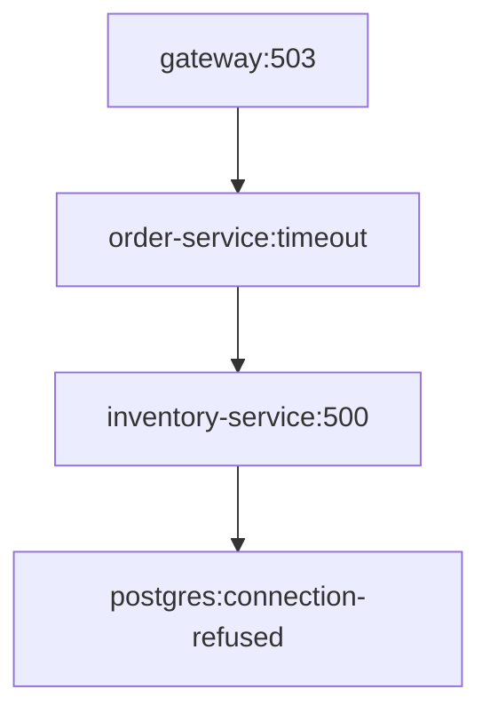

# Trace Mapper Skill

## Purpose

Trace Mapper analyzes distributed tracing data to identify performance bottlenecks, cascade failures, and service dependency issues in microservices architectures. It processes trace data from Jaeger, Zipkin, or OTLP collectors and generates visual dependency graphs, latency heatmaps, and error propagation reports.

**Real use cases:**
- Investigate p99 latency spikes in production services
- Identify single points of failure in service mesh
- Analyze root cause of partial system outages
- Validate architecture decisions post-deployment
- Capacity planning based on trace-derived load patterns
- Detect circular dependencies causing retry storms

## Scope

Commands available:
- `analyze-traces` - Process trace data and identify anomalies
- `map-dependencies` - Generate service dependency graph
- `find-bottlenecks` - Pinpoint latency bottlenecks with flame analysis
- `trace-compare` - Compare trace patterns between deployments
- `error-propagation` - Track error cascades across services
- `export-report` - Generate HTML/PDF analysis report
- `live-monitor` - Stream trace analysis in real-time
- `sampling-stats` - Report on trace sampling coverage

## Detailed Work Process

### 1. Prerequisites Validation
```bash
openclaw skill trace-mapper check-env
```
Verifies trace endpoints are reachable and Python dependencies are installed.

### 2. Trace Collection
```bash
openclaw trace-mapper analyze-traces \
  --sources jaeger,zipkin \
  --window "24h" \
  --service-checkout,order,payment \
  --output-format parquet
```
- Queries configured trace backends
- Applies time window filtering
- Normalizes span contexts across formats
- Outputs Arrow table for analysis

### 3. Dependency Mapping
```bash
openclaw trace-mapper map-dependencies \
  --input traces.parquet \
  --min-calls 10 \
  --exclude "istio-proxy,envoy" \
  --format dot \
  --output dependency_graph.dot
```
- Builds directed graph of service calls
- Filters infra proxies
- Calculates edge weights by call volume
- Exports to Graphviz DOT format

### 4. Bottleneck Analysis
```bash
openclaw trace-mapper find-bottlenecks \
  --input traces.parquet \
  --threshold-p95 500ms \
  --threshold-error-rate 0.01 \
  --output bottlenecks.json
```
- Computes p50/p95/p99 latencies per service
- Identifies services exceeding thresholds
- Flags high error propagation paths
- Produces JSON with remediation suggestions

### 5. Report Generation
```bash
openclaw trace-mapper export-report \
  --analysis bottlenecks.json \
  --graph dependency_graph.dot \
  --template default \
  --output /reports/trace-analysis-$(date +%Y%m%d).html
```
Renders interactive HTML with:
- Service dependency topology
- Latency heatmap
- Top 10 slowest operations
- Error cascade visualization

## Golden Rules

1. **Preserve trace context** - Never break trace ID chains when filtering; use `trace_id` as primary key
2. **Handle sampling transparency** - Always report sampling rate and adjust confidence intervals accordingly
3. **Respect data retention** - Query only within retention window (default: 30 days); use `--window` to limit scope
4. **Secure PII** - Scrub user identifiers from logs/attributes; enable `--anonymize` for GDPR compliance
5. **Validate before export** - Run `verify-graph` to ensure dependency graph is acyclic; circular dependencies indicate instrumentation bugs
6. **Resource limits** - Never load >10M spans in memory; use `--chunk-size 100000` and streaming aggregation
7. **Time synchronization** - All traces must use UTC; warn on non-monotonic timestamps
8. **Service naming consistency** - Normalize service names (k8s namespace stripping) before mapping

## Examples

### Example 1: Find slow database calls in checkout flow
```bash
# Collect last 6 hours of traces for checkout services
openclaw trace-mapper analyze-traces \
  --window "6h" \
  --services "checkout,payment,inventory" \
  --min-duration 100ms \
  --output raw_spans.arrow

# Extract database operations
openclaw trace-mapper filter-spans \
  --input raw_spans.arrow \
  --tag "db.statement" \
  --output db_calls.arrow

# Calculate slowest queries
openclaw trace-mapper aggregate \
  --input db_calls.arrow \
  --group-by "db.statement,service_name" \
  --metrics "duration:avg:95th:count" \
  --output db_slow_queries.csv
```
Output: CSV with columns `db.statement,service_name,duration_avg,duration_95th,count` sorted by p95 descending.

### Example 2: Detect retry storms
```bash
# Compare traces before and after deployment
openclaw trace-mapper trace-compare \
  --baseline traces-pre-deploy.arrow \
  --current traces-post-deploy.arrow \
  --service "order-service" \
  --metric "retry_count" \
  --threshold-increase 2.0x \
  --output retry_analysis.json
```
Output JSON:
```json
{
  "service": "order-service",
  "operation": "HTTP POST /api/orders",
  "baseline_retries": 0.02,
  "current_retries": 0.15,
  "increase_factor": 7.5,
  "status": "REGRESSION_DETECTED"
}
```

### Example 3: Generate on-call runbook visualization
```bash
openclaw trace-mapper error-propagation \
  --input traces.arrow \
  --error-filter "status_code>=500" \
  --depth 3 \
  --format mermaid \
  --output runbook-diagram.md
```
Output (Markdown):
````markdown

````

### Example 4: Real-time monitoring during incident
```bash
# Stream live trace analysis
openclaw trace-mapper live-monitor \
  --source jaeger \
  --service "payment-*" \
  --alert-threshold-error-rate 0.05 \
  --alert-threshold-p99 2000ms \
  --update-interval 30s
```
Streaming output:
```
[14:32:15] payment-service: p99=1850ms (OK), error_rate=0.02 (OK)
[14:32:45] payment-processor: p99=3420ms ⚠️  error_rate=0.08 ⚠️  ALERT: Degradation detected
```

## Dependencies and Requirements

**System:**
- `jq` (JSON processing)
- `graphviz` (DOT rendering)
- Python 3.9+ with pip packages

**Python packages** (installed via `pip install pyarrow pandas networkx matplotlib plotly`)

**Trace backends** (at least one required):
- Jaeger: `jaeger-client` with HTTP query endpoint
- Zipkin: `zipkin-client` (v2 API)
- OTLP: `otlp-collector` gRPC endpoint

**Storage options:**
- Elasticsearch (for trace storage)
- ClickHouse (high-volume traces)
- Grafana Tempo (native OTLP)

**Environment variables:**
```bash
export JAEGER_ENDPOINT="http://jaeger:16686/api/traces"
export ZIPKIN_ENDPOINT="http://zipkin:9411/api/v2/traces"
export OTLP_ENDPOINT="http://otel-collector:4317"
export TRACE_SOURCES="jaeger"  # comma-separated
export ANALYSIS_WINDOW="1h"    # relative time window
```

## Verification Steps

1. **Check dependencies:**
```bash
openclaw skill trace-mapper check-env --verbose
```
Expected output:
```
✓ jq 1.6 detected
✓ graphviz 2.50.0 detected
✓ python3 3.11.2 detected
✓ pyarrow 14.0.1 installed
✓ pandas 2.1.4 installed
✓ NetworkX 3.2 installed
✓ matplotlib 3.8.2 installed
✓ plotly 5.18.0 installed
✓ Jaeger endpoint reachable (200 OK)
✓ Trace sampling rate: 1.0 (100%)
```

2. **Test with sample data:**
```bash
openclaw trace-mapper analyze-traces \
  --window "1h" \
  --limit 1000 \
  --output test_output.arrow
```
Verify output file exists and `ls -lh test_output.arrow` shows non-zero size.

3. **Validate dependency graph:**
```bash
openclaw trace-mapper map-dependencies \
  --input test_output.arrow \
  --format dot \
  --output test_graph.dot
dot -Tpng test_graph.dot -o test_graph.png  # Should succeed without cycles
```

## Troubleshooting

### Issue: "No traces found in time window"
**Fix:** Extend `--window` parameter. Verify trace retention:
```bash
curl $JAEGER_ENDPOINT/condebose?limit=1
# If empty, traces older than retention period
```

### Issue: "Graph contains cycles"
**Cause:** Circular dependencies in instrumentation (service A → B → A)
**Fix:** Identify with:
```bash
openclaw trace-mapper detect-cycles \
  --input dependency_graph.dot
```
Remove harmful instrumentation or add `--exclude` for problematic services.

### Issue: "Memory exceeded when processing 10M+ spans"
**Fix:** Enable chunked processing:
```bash
openclaw trace-mapper analyze-traces \
  --chunk-size 50000 \
  --parallel-jobs 4 \
  --output large_dataset.arrow
```

### Issue: "Sampling rate too low for statistical significance"
**Warning:** `< 1% sampling detected on service X`
**Fix:** Increase sampling for critical services or extend analysis window:
```bash
export SAMPLING_RATE="0.1"  # 10% for debugging
# Or aggregate over longer window
openclaw trace-mapper analyze-traces --window "7d"
```

### Issue: "Timestamp mismatch between trace sources"
**Fix:** Ensure all sources use UTC. Check with:
```bash
openclaw trace-mapper check-timesync \
  --sources jaeger,zipkin
```
Configure NTP on collectors if drift >1s.

## Rollback Commands

### Undo analysis artifacts
```bash
# Remove all generated files from current session
rm -f *.arrow *.json *.dot *.html *.csv *.png *.pdf

# Clear temporary cache
rm -rf /tmp/openclaw-trace-cache/
```

### Restore previous trace snapshot
```bash
# If analysis was based on corrupted data, revert to known-good snapshot
openclaw trace-mapper restore-snapshot \
  --snapshot-id "pre-analysis-$(date +%Y%m%d)" \
  --target-dir ./analysis_artifacts
```

### Disable heavy analysis temporarily
```bash
# Revert to lighter monitoring
openclaw trace-mapper live-monitor \
  --sampling-rate 0.01 \  # Reduce from 1.0 to 1%
  --metrics-only "duration,status_code"
```

### Reset configuration overrides
```bash
# Remove custom thresholds
unset TRACE_THRESHOLD_P95
unset TRACE_THRESHOLD_ERROR_RATE
# Restore defaults
openclaw trace-mapper set-thresholds --defaults
```

### Emergency stop on production impact
```bash
# If trace collection impacts production systems:
export JAEGER_QUERY_DISABLE=true
export ZIPKIN_QUERY_DISABLE=true
# Confirmed: trace collection paused
openclaw trace-mapper health-check --mode passive-only
```

## Inputs and Outputs

**Input formats:**
- Jaeger JSON (via API)
- Zipkin JSON v2
- OTLP protobuf (converted internally to Arrow)
- Pre-parsed Arrow/Parquet files

**Outputs:**
- `*.arrow` - normalized trace dataset for further analysis
- `*.dot` - Graphviz dependency graph
- `*.json` - bottleneck analysis, error propagation chains
- `*.html` - self-contained interactive report
- `*.csv` - aggregated metrics for spreadsheet analysis

## Performance Notes

- 1M spans ≈ 500MB in Arrow format
- Dependency graph rebuild: ~2s per 100K spans
- Full analysis pipeline: ~60s for 1M spans on 4-core machine
- Memory usage: ~2× input size during processing
- Enable `--compress-output gzip` to reduce disk usage 75%

## Security Considerations

- Trace data may contain PII in `http.url`, `rpc.method` fields
- Always enable `--anonymize` for external sharing
- Restrict access to trace backends via network policies
- Rotate API credentials used for trace ingestion
- Audit logs of analysis jobs should be retained 90 days
```